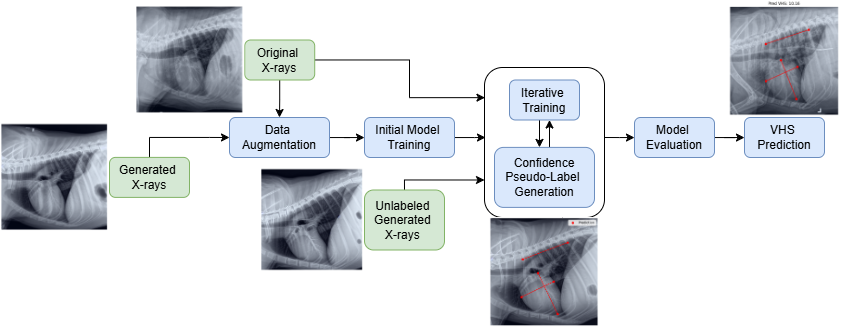
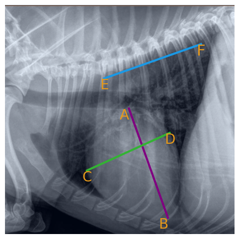
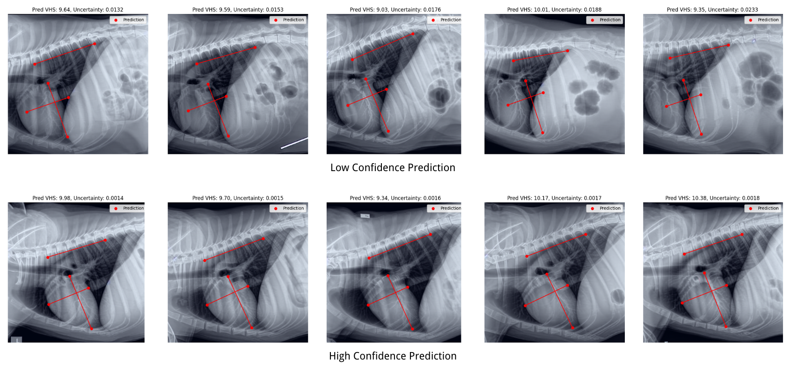
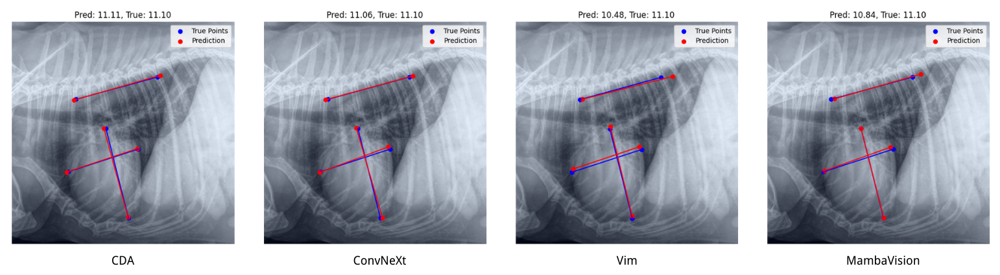

# Confident Pseudo-labeled Diffusion Augmentation for Canine Cardiomegaly Detection

## Overview

This repository contains the implementation of the Confident Pseudo-labeled Diffusion Augmentation (CDA) model, a novel approach for detecting canine cardiomegaly. By integrating synthetic data augmentation with diffusion models, high-confidence pseudo-labeling using Monte Carlo (MC) Dropout, and iterative training, the CDA model achieves state-of-the-art accuracy in Vertebral Heart Score (VHS) prediction and canine cardiomegaly classification.



---

## Features

- **Synthetic Data Augmentation**: Generates anatomically plausible chest X-rays to address data scarcity.
- **Pseudo-labeling with Monte Carlo Dropout**: Leverages high-confidence predictions for iterative training.
- **State-of-the-Art Results**: Achieves 92.8% test accuracy, outperforming existing models.
  
---

## VHS Calculation

The model predicts the Vertebral Heart Score (VHS) using key anatomical landmarks identified in the X-ray. These landmarks are used to compute the VHS based on the following formula:

VHS = 6 * (AB + CD) / EF

### Key Points for VHS Calculation

1. **AB**: Long axis of the heart, measured from the carina to the apex.
2. **CD**: Short axis of the heart, perpendicular to AB at its widest point.
3. **EF**: Length of the vertebral segment, starting from the fourth thoracic vertebra.



---

## High-Confidence vs Low-Confidence Predictions

One of the key features of the Confident Pseudo-labeled Diffusion Augmentation (CDA) model is its ability to differentiate between high-confidence and low-confidence predictions during pseudo-labeling. This ensures only reliable data is incorporated into the training process, improving the model's accuracy and robustness.

The figure below illustrates the comparison between high-confidence and low-confidence predictions:



### Explanation:
- **Top Row (Low-Confidence Predictions):** These predictions have higher uncertainty values, leading to inaccurate key point alignment and less reliable Vertebral Heart Score (VHS) estimations.
- **Bottom Row (High-Confidence Predictions):** These predictions show well-aligned key points and consistent VHS calculations, as their uncertainty values fall below the confidence threshold.

This distinction is achieved using Monte Carlo (MC) Dropout, which enables uncertainty estimation by performing multiple stochastic forward passes through the model during inference. By filtering out low-confidence predictions using a threshold (uncertainty < 0.005), the model ensures only reliable data is incorporated into the training process.

---

## Results

The Confident Pseudo-labeled Diffusion Augmentation (CDA) model demonstrates state-of-the-art performance in predicting Vertebral Heart Score (VHS) and classifying canine cardiomegaly. 

### Performance Comparisons
Our model achieves a test accuracy of **92.8%**, outperforming several baseline models, as shown in the table below:


| Model                     | Valid Acc (%) | Test Acc (%) |
|---------------------------|---------------|--------------|
| ConvNeXt                  | 89.5          | 89.8         |
| Vim                       | 73.5          | 71.5         |
| MambaVision               | 87.5          | 86.8         |
| **CDA w/o Pseudo-labels** | 88.5          | 91.0         |
| **CDA**                   | **89.5**      | **92.8**     |

The CDA model's integration of pseudo-labeling with Monte Carlo Dropout and diffusion-based synthetic data augmentation contributes significantly to these performance improvements.

### Visual Comparison of Predictions
The figure below illustrates a visual comparison of key point predictions made by CDA and other state-of-the-art models.



- **Key Points (CDA in Red):** The CDA model accurately aligns the predicted key points (red) with the ground truth (blue), achieving precise VHS predictions.
- **Baseline Models:** Other models show varying levels of deviation, particularly in key point alignment and VHS estimation.

These results demonstrate the robustness and reliability of the CDA model for VHS prediction and cardiomegaly classification. The integration of pseudo-labeling and synthetic data augmentation significantly enhances model accuracy and generalizability, setting a new benchmark for veterinary diagnostics.

---

## Installation

1. Clone the repository:
   ```bash
   git clone https://github.com/Shira7z/CDA.git
   cd CDA
   ```

2. Install dependencies:
   ```bash
   pip install -r requirements.txt
   ```

## Directory Structure
The repository is organized as follows:
```bash
src/
|
├── dataset.py          # Dataset loaders for labeled and unlabeled data
├── model.py            # Model definition and VHS calculation
├── initial_train.py    # Initial training script
├── iterative_train.py  # Iterative training with pseudo-labeling
├── pseudo_labeling.py  # High-confidence pseudo-label generation
├── evaluate.py         # Evaluation and inference functions
├── utils.py            # Helper functions
```

## Usage

1. Initial Training: Train the model with labeled data to obtain the best initial model.
```python
from dataset import DogHeartDataset
from torch.utils.data import DataLoader
from initial_train import train_initial_model
from utils import get_transform

# Load datasets
train_dataset = DogHeartDataset('path/to/train_dataset', transforms=get_transform(512))
valid_dataset = DogHeartDataset('path/to/valid_dataset', transforms=get_transform(512))

train_loader = DataLoader(train_dataset, batch_size=16, shuffle=True)
valid_loader = DataLoader(valid_dataset, batch_size=8, shuffle=False)

# Train the model
device = torch.device('cuda' if torch.cuda.is_available() else 'cpu')
train_initial_model(train_loader, valid_loader, device, num_epochs=1000, lr=3e-4)
```

2. Iterative Training with Pseudo-Labeling: Refine the model using unlabeled data.
```python
from dataset import DogHeartDataset, DogHeartTestDataset
from torch.utils.data import DataLoader
from iterative_train import train_with_pseudo_labels
from utils import get_transform

train_dataset = DogHeartDataset('path/to/train_dataset', transforms=get_transform(512))
unlabeled_dataset = DogHeartTestDataset('path/to/unlabeled_dataset', transforms=get_transform(512))
valid_dataset = DogHeartDataset('path/to/valid_dataset', transforms=get_transform(512))

train_loader = DataLoader(train_dataset, batch_size=16, shuffle=True)
unlabeled_loader = DataLoader(unlabeled_dataset, batch_size=16, shuffle=False)
valid_loader = DataLoader(valid_dataset, batch_size=8, shuffle=False)

checkpoint_path = '/path/to/best_initial_model_checkpoint.pth'
checkpoint = torch.load(checkpoint_path, map_location=device, weights_only=True)

device = torch.device('cuda' if torch.cuda.is_available() else 'cpu')
train_with_pseudo_labels(train_loader, unlabeled_loader, valid_loader, checkpoint, device, num_epochs=100, lr=1e-5)
```


